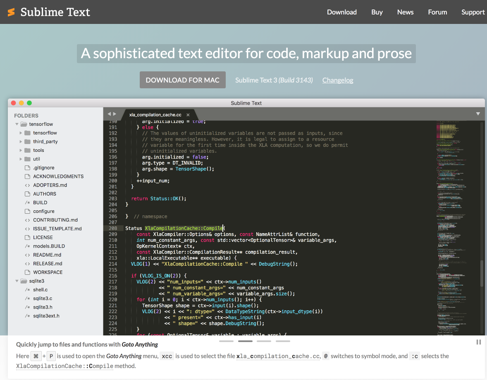

#Setup

Make sure you download and install Sublime Text 3 from

 - <http://www.sublimetext.com/>

Select the appropriate download for your laptop (OS, Windows, Linux)

## Adobe Connect

As part of this lab session, we will also be trying out Adobe Connect. Please visit this site here:

https://adbconnect.wit.ie/common/help/en/support/meeting_test.htm

and run through the tests there...