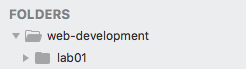

#First Project

Consider creating a folder structure for your labs - starting with a folder called `web-development`

Open Sublime and choose `Open` from the File menu, navigate to the `web-development` folder you have just created and click `Open`.

In sublime click on the `web-development` folder, right click - and select `New Folder`. Enter the folder name `lab01`. In Sublime, you should see the following in the sidebar:

Chose New File from the File menu, a new blank page should appear in the sublime window. Click `Save` on the File menu and name the file `index.html`, save it into the lab01 folder. You should see the file name appear in the left panel in sublime.

Now in File Explorer create another folder in Lab1 that is called images

Next you are to save the following images into the images folder:

Right click on each one and choose Save As. Make sure you save them into the Images folder.

It is worth making sure your folder structure is the same as this:

The WebDevelopment folder will hold a folder for each lab you work on for this module. For today the Lab1 folder will contain at least one .hmtl file as well as an images folder which in turn contains 6 images.