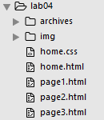

#Setup

For this lab, start with the this project here:

- [lab04a](./archives/lab04a-starter.zip)

This archive contains the following pages:

- [home.html](./archives/lab04a-starter/home.html)
- [home.css](./archives/lab04a-starter/home.css)
- [page1.html](./archives/lab04a-starter/page1.html)
- [page2.html](./archives/lab04a-starter/page2.html)

Download and expand the zip file above, or alternatively in your browser, you can select 'save link as' or equivalent and save these into your own workstation. To do this you will first have to locate the actual folder in which the lab05 project is stored, save the four files into that folder.

Either way, we wish to use the above as the basis for this lab.