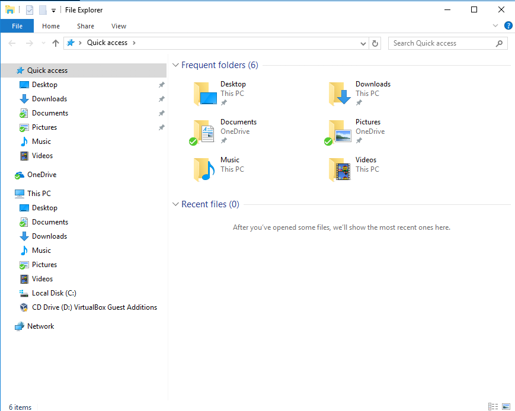
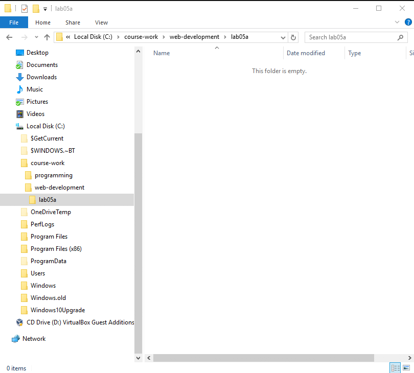
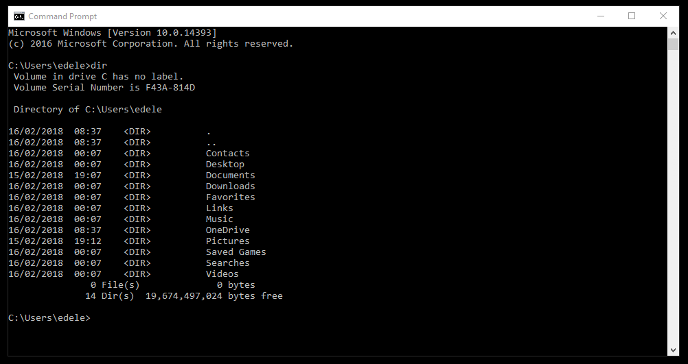
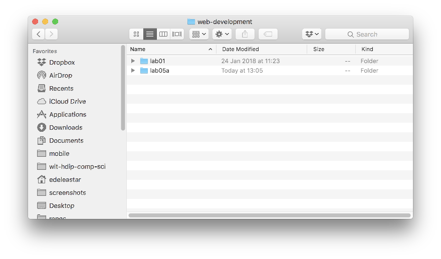

# Explorer & Command Prompt (Windows)

## Explorer

You may be alrady familiar with the windows Explorer application:

In particular, you should get used to undersanding and managing the structure of folders based in on your `C:` drive:

Try to replicate the following structure as an exercise:

In the above we have a `course-work` folder, containg a `web-development` and a `programming` folders. `web-development` contains a folder called `lab05a`

## Command Prompt

Open a command prompt on Windows. The easiest way to do this is in Windows to type 'cmd' in the Search Box on the Windows start menu:

From now on, you will be using this command line regularly - so we can 'pin' it to the task par for convenience (do this by right clicking):

This should make it appear on the end of the taskbar like this:

Now, you can launch it from the taskbar whenever you need it:

Try out the `dir` command:

Also experiment with closing and reopening the console application.

# Finder & Terminal

On Mac, the equivalent of Explorer:

For the Command prompt, install Iterm2:

- <https://www.iterm2.com>

