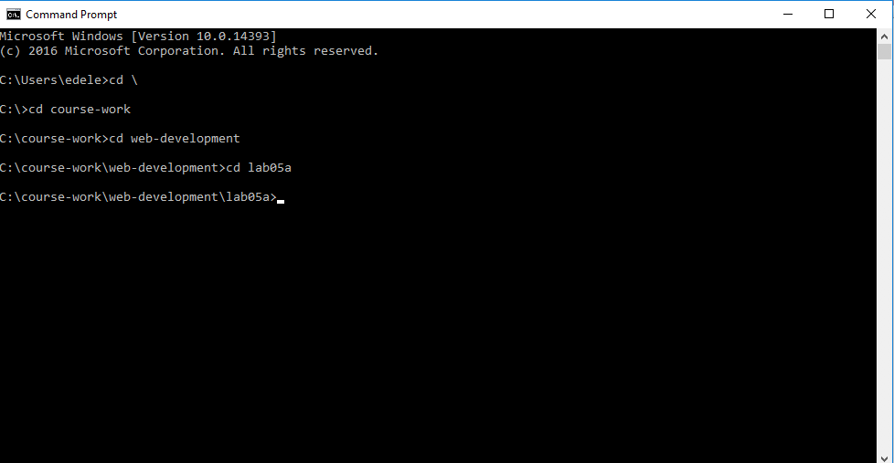

#Command Line (Windows)

This is an alternative interface to Windows which it is important to become familiar with. In this window you can type what are sometimes called 'DOS' commands. These commands let you have a finer level of control of your PC, and are particularly important for programmers to master.

Here are some simple commands:

- dir
    - list all files in a directory
- cd ..
    - change to a parent directory
- cd `<directory name>`
    - change to a specific directory

It is essential that you become adept at these commands, and a few others.

Bear in mind that these commands always have a 'current directory' (a directory is another name for a folder). Try them now and see if you can 'navigate' to your `lab05a` folder. If the folder is located as shown here:

Then the commands to get there will look like this:

The commands entered above were

- `cd \`
- `cd course-work`
- `cd web-development`
- `cd lab05a`

Note in all of the above that the 'prompt' in the command window is always showing the 'current' drive/directory.

Also, if you have a 'space' in your directory (a bad idea generally), then you will have to use quotation marks in the commands. This can get difficulty to type, so in general it is best to adopt the following conventions.

- Never use spaces in directory or file names

- Never use upper case in directory or file names

- If you wish to use readable multiple words for a directory or file name, separate the words with '-'. e.g.
    - web-development
    - java-projects

Perhaps you might take this opportunity to adjust your workspace and projects to adopt the above conventions. If you do, then you will find that using DOS commands to navigate your folders will be considerably easier.

Before going on to the next step, make sure you are comfortable navigating in DOS around the file system, and in particular make sure you can navigate to your web development workspace.

Also, get used to using File Explorer in parellel - keeping an eye on where you are in the folder tree structure.

Finally, this 15 minute tutorial on the DOS command line might be worth skimming:

- [Windows Command Line in 15 Minutes](https://www.cs.princeton.edu/courses/archive/spr05/cos126/cmd-prompt.html)

The Command line we have been touring here has largely been superceeded by a newer application called `Powershell`. However, we will stick to the DOS shell here for the moment.

## Comand Line (Mac)

Commands on the mac as similiar - review this short tutorial here for the basics:

- <https://www.macworld.co.uk/feature/mac-software/how-use-terminal-on-mac-3608274/>
