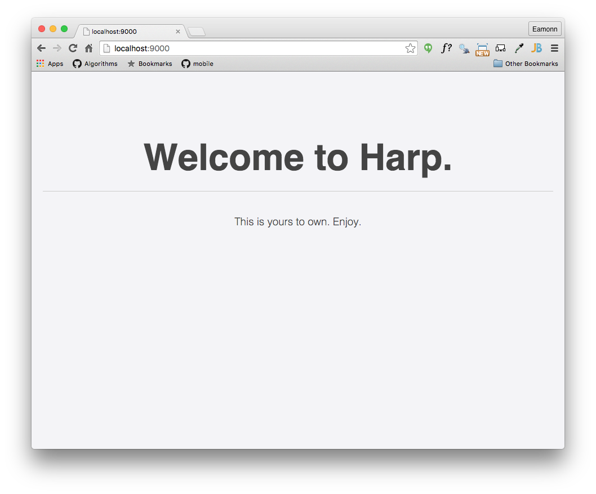

# Using Harp

Before entering the next few commands, make sure you know EXACTLY where your command prompt session is located in the folder structure. Perhaps you may be somewhere like:

- `C:\course-work\web-development\lab05a`

See the previous step for guidance on this. If you are evey confused as to which folder tour command promot is based in, just enter this command:

~~~
dir
~~~

This will list the `current` diretory contents.

## Using Harp

Once harp installed, then from the command prompt again, you will be able to carry out these commands :

~~~
harp init demo
~~~

This will respond with: 

~~~
Downloading boilerplate: https://github.com/harp-boilerplates/default
Initialized project at /Users/edeleastar/repos/wit-hdip-comp-sci/web-development/lab05a/demo
~~~

Then enter:

~~~
cd demo
harp server
~~~

Which will respond with: 

~~~
Harp v0.25.0 – Chloi Inc. 2012–2015
Your server is listening at http://localhost:9000/
Press Ctl+C to stop the server
------------
~~~

Now browse to this url here:

- <http://localhost:9000>

and you should see this page:

To stop 'serving' the page, enter Ctrl-C in the command prompt:

~~~
Harp v0.25.0 – Chloi Inc. 2012–2015
Your server is listening at http://localhost:9000/
Press Ctl+C to stop the server
------------
^C
 
~~~

