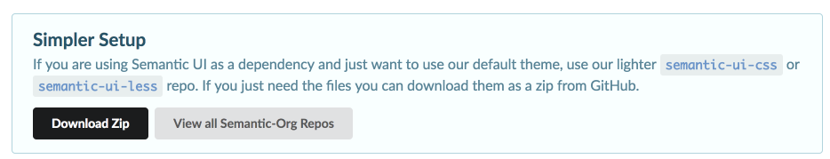

#semantic.css

The first step is to download and save the semantic style sheet. Download from here:

 - <https://semantic-ui.com/introduction/getting-started.html>

Download the archive from the link shown below (don't attempt to rebuild the framework from source)

and expand it. It will look like this:

~~~
Semantic-UI-CSS-master
├── LICENSE
├── README.md
├── components
│   ├── accordion.css
│   ├── accordion.js
│   ├── ...
│   ├── ...
│   ├── visibility.min.js
│   ├── visit.js
│   └── visit.min.js
├── package.js
├── package.json
├── semantic.css
├── semantic.js
├── semantic.min.css
├── semantic.min.js
├── t.md
└── themes
    └── default
        └── assets
            ├── fonts
            │   ├── icons.eot
            │   ├── icons.otf
            │   ├── ...
            │   └── icons.woff2
            └── images
                └── flags.png
~~~

Rename the folder to `semantic`. and copy into the `assets` folder of your project. Your project structure should look something like this:

~~~
└── public
    ├── assets
    │   └── images
    │       ├── automotive.png
    │       ├── banner.jpg
    │       ├── ctrg.png
    │       ├── iot
...
    │   └── semantic
    │       ├── LICENSE
    │       ├── README.md
    │       ├── components
    │       │   ├── accordion.css
                 ....
                 .....
    │       ├── package.js
    │       ├── package.json
    │       ├── semantic.css
    │       ├── semantic.js
    │       ├── semantic.min.css
    │       ├── semantic.min.js
    │       └── themes
    │           .....
    ├── index.html
    ├── strands
    │   ├── data.html
    │   ├── devices.html
    │   ├── maths.html
    │   ├── networks.html
    │   ├── programming.html
    │   └── project.html
    └── style.css
~~~

