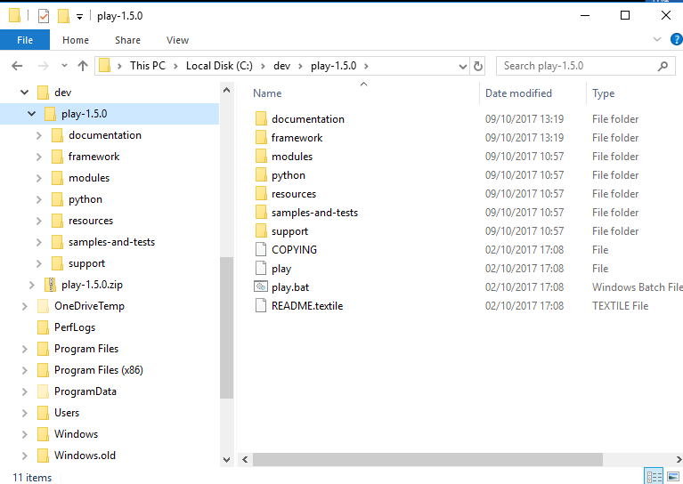
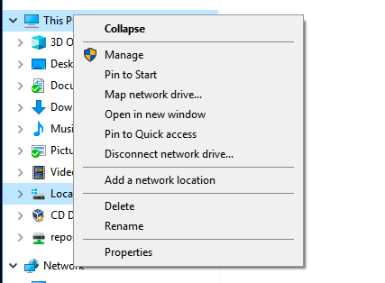

#Installing and Running Play

##Windows

Visit the following site:

- <http://www.playframework.org>

In particular, vist the download page:

- <https://www.playframework.com/download#older-versions>

On the this page, select and download `play-1-5.0.zip` (the version number is very important)

Unzip to somewhere on your PC - a good location might be:

~~~
C:\dev
~~~

Once you have unzipped it, the folder might look like this:

In the above, the play archive has been downloaded and expanded in `c:\dev`

We need to now add the play folder to the `system path` - which will enable us to run the play command from a command prompt.

## Windows

For Windows, you need to do the following:

Locate the "Computer" icon in explorer

Right click on this and select 'Properties':

Select 'Advanced System Settings':

Select 'Environment Variables':

Under "System Variables", locate and select the 'Path' entry:

Edit this entry:

Be pressing `New` - add a new entry to this list:

This new entry should be the path where play is installed. This could be `C:\dev\play-1.5.0` as in the above example.

NB: DO NOT DELETE ANY OF THE CURRENT VALUES OF THE PATH!

Press "Ok" all the way back and rerun the command prompt (close the one already open).

To test, just type "play" from a command prompt you should see something like this:

~~~
~        _            _
~  _ __ | | __ _ _  _| |
~ | '_ \| |/ _' | || |_|
~ |  __/|_|\____|\__ (_)
~ |_|            |__/
~
~ play! 1.5.0, http://www.playframework.org
~
~ Usage: play cmd [app_path] [--options]
~
~ with,  new      Create a new application
~        run      Run the application in the current shell
~        help     Show play help
~~~

Or, if you did not manage to get the play folder on the path, then this command here should work (if you used the recommended folder structure)

~~~
C:\dev\play1-1.5.0\play
~~~

However, it is best to ensure that the play command is on the system path.

##Mac/linux Users

Edit your .bash_profile in your home directory and extend the path to include the play folder we have already extracted. It might look like this:

~~~
PATH=$PATH:$HOME/bin:/usr/local/bin:\
/usr/local/opt/node@8/bin:\
$HOME/dev/play-1.5.0
export PATH
~~~

This assumes you extracted the play archive into the dev folder in your home folder.

