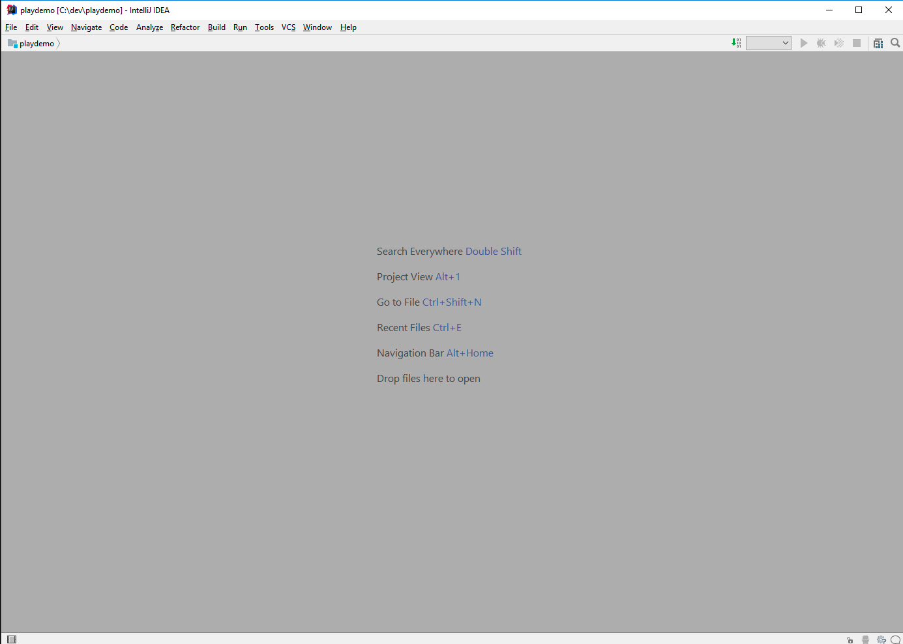
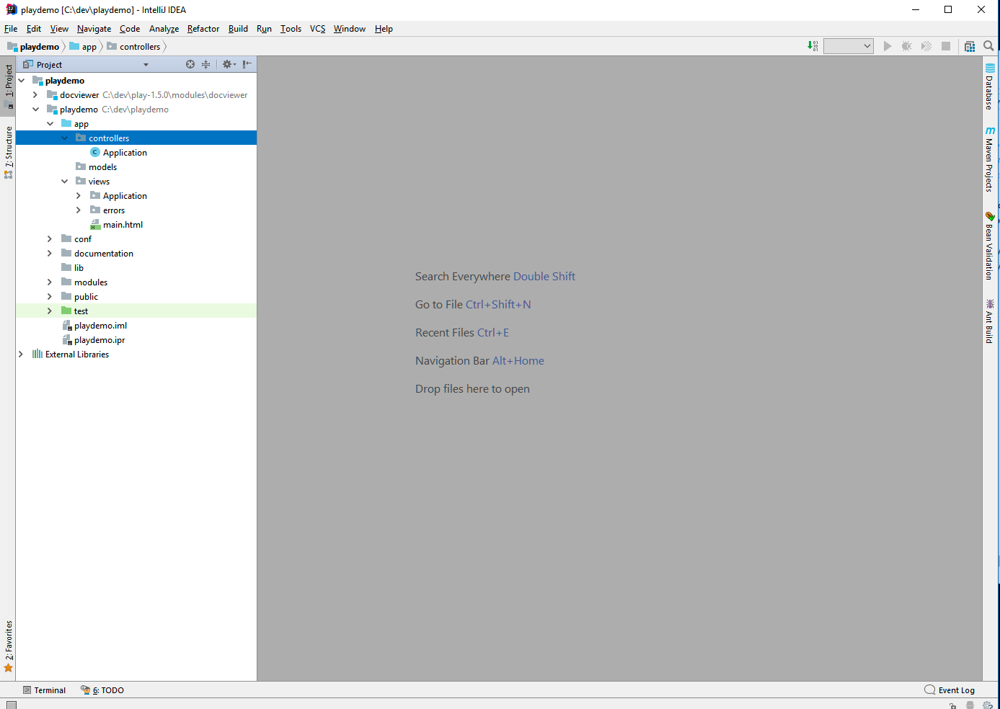
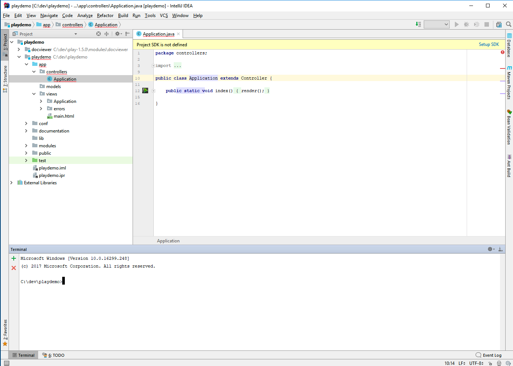
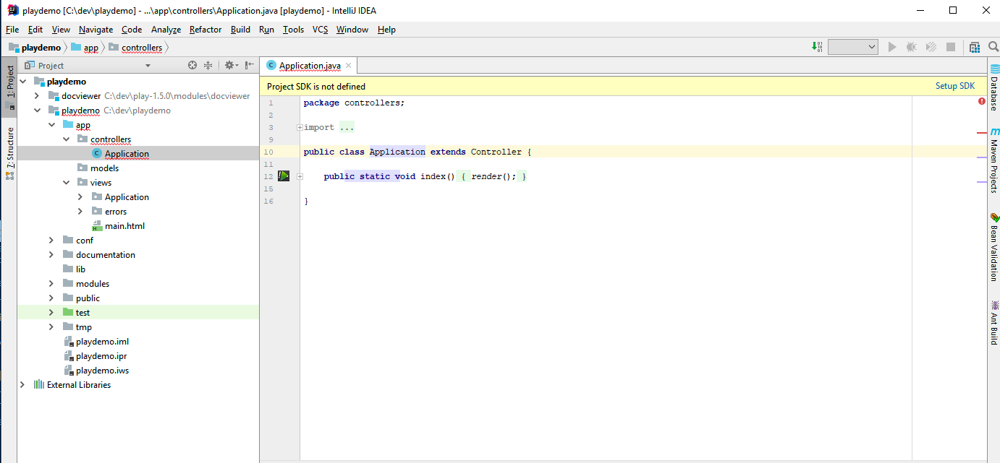
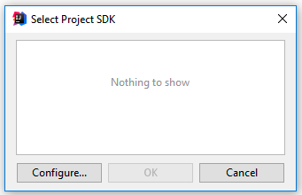
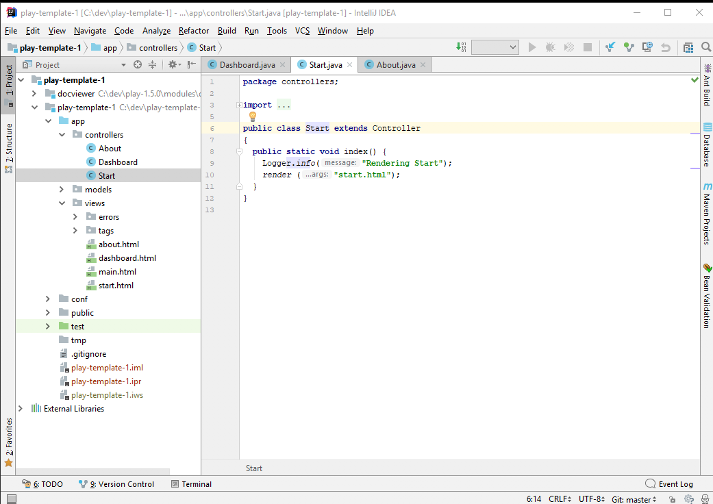

# Import into Idea

Now, making sure you are still in the playdemo folder, run this command:

~~~
play idealize
~~~

The system will respond with:

~~~
        _            _
~  _ __ | | __ _ _  _| |
~ | '_ \| |/ _' | || |_|
~ |  __/|_|\____|\__ (_)
~ |_|            |__/
~
~ play! 1.5.0, https://www.playframework.com
~
~ OK, the application is ready for Intellij Idea
~ Use File, Open Project... to open "playdemo.ipr"
~
~~~

Now, launch IntelliJ Idea, and select `Import Project`:

Navigate to the playdemo folder, and select the project folder to import:

Be sure to select the 'playdemo' only as shown above.

Once imported into Idea, it might look like this:

You may need to press the button on the extreme bottom left - and them expand the project window to reveal the project details:

Now select the `Application` icon - to open the Java Application class:

The first time you run this - there may be an error visible on the title bar as `Project SDK is not defined'

Press the `Setup SDK` button:

Press `Configure`:

Press `+`:

Select `JDK`

Navigate to the appropriate folders on your system and select the JDK for java 8.

Press `OK`

This should remove the error - and the project should now be correctly configured.

