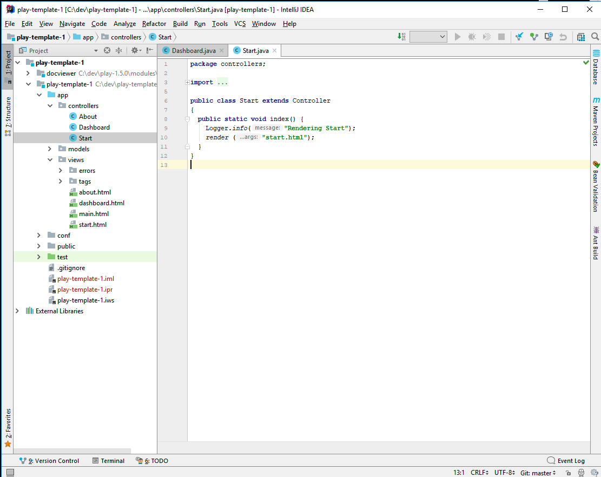

# Creating a Play App

## Create New Project

Create a new play project - this time using a different procedure from the first lab. Open a shell and enter the following:

~~~
git clone https://github.com/edeleastar/play-template-1.git
~~~

The shell should show something like this:

~~~
Cloning into 'play-template-1'...
remote: Counting objects: 66, done.
remote: Compressing objects: 100% (47/47), done.
remote: Total 66 (delta 9), reused 66 (delta 9), pack-reused 0
Unpacking objects: 100% (66/66), done.
~~~

## Rename Project

The default name of the project should be changed now. This will require the following procedure:

- Rename the folder `play-template-1`. Call the folder `playlist` instead.
- Use Sublime Text to edit this file: `playlist/conf/application.conf`. The first three lines contains the following:

    ~~~
    # This is the main configuration file for the application.
    # ~~
    application.name=play-template-1
    ~~~

- Change `play-template-1` above to `playlist`, and save the file:

    ~~~
    # This is the main configuration file for the application.
    # ~~
    application.name=playlist
    ~~~

## Import into Idea

Still in the shell, and in the project folder enter the following command:

~~~
play idealize
~~~

You should get this response:

~~~
~        _            _
~  _ __ | | __ _ _  _| |
~ | '_ \| |/ _' | || |_|
~ |  __/|_|\____|\__ (_)
~ |_|            |__/
~
~ play! 1.5.0, https://www.playframework.com
~
~ OK, the application is ready for Intellij Idea
~ Use File, Open Project... to open "play-template-1.ipr"
~
~~~

Now we can import the project into Idea. Launch Idea, and select `File->Open`. Select the Directory containing the project you have just created (play-template-1)

(Again - you may need to press the button on the extreme bottom left to get the view shown above)

Explore the `controllers` and `views` - examining each file.
