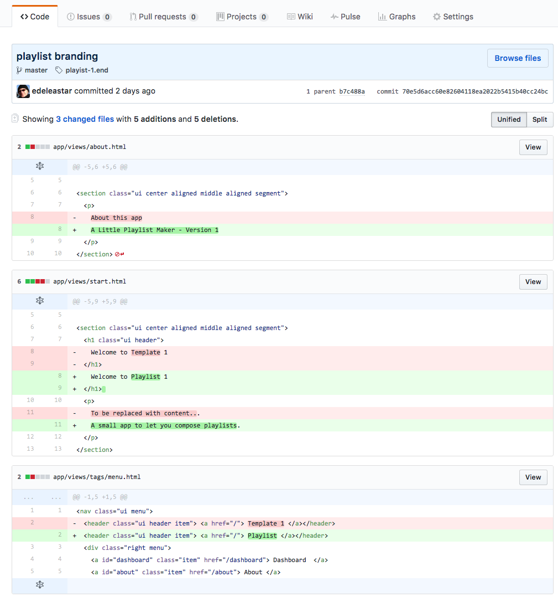

# Exercises 

## Exercise 1: Download and Rename Sample Solution

A complete version of the app as it should be at the end of this lab:

- <https://github.com/edeleastar/playlist/releases/tag/playist-1.end>

However, if you already have a project called 'playlist' in your workspace, then you may not be able to import it into eclipse. So, first rename the project to `playlist-1` (covered in step 1), and then run this command:

~~~
play idealize
~~~

... and then import as shown in Step 1. 

## Exercise 2: Review Playlist Data Structure

Look again at the playlist as represented in:

~~~
    Song s1 = new Song("Piano Sonata No. 3", "Beethoven");
    Song s2 = new Song("Piano Sonata No. 7", "Beethoven");
    Song s3 = new Song("Piano Sonata No. 10", "Beethoven");
    Playlist p1 = new Playlist("Beethoven Sonatas");
    p1.songs.add (s1);
    p1.songs.add (s2);
    p1.songs.add (s3);
    
    Song s4 = new Song("Piano Concerto No. 1", "Beethoven");
    Song s5 = new Song("Piano Concerto No. 12", "Beethoven");
    Song s6 = new Song("Piano Concerto No. 23", "Beethoven");
    Playlist p2 = new Playlist("Beethoven Concertos");
    p2.songs.add (s4);
    p2.songs.add (s5);
    p2.songs.add (s6);
    
    List<Playlist> playlists = new ArrayList<Playlist>();
    playlists.add(p1);
    playlists.add(p2);
~~~

Review the structure carefully. Can you draw a picture of the structure of the data?

## Exercise 3: Add a new playlist

Extend your version of the app to contain a new playlist - make up some songs. Verify that they are rendered as expected.

## Exercise 4: New Fields

Extend the playlist to have new entry called `duration`. Also, extend each song to also have a `duration` field + a `genre` field. Change the constructor to initialise these fields.

Modify the dashboard view to display these new fields.

## Exercise 5: Extend Views

Extend the following views:

- Welcome: Extend the welcome view to contain a more detailed outline of the purpose of the application
- About: Extend the about view to provide contact details (may be fictitious) for the author/company that created the app.

## Exercise 6: Review the Project History

This link here shows the project history as constructed in this lab:

- <https://github.com/edeleastar/playlist/commits/master>

If you select the one of the commits (press the hex code link):

Then you can see in detail the changes made at that commit:

Red indicated code removed, green is new code. Spend some time looking at each of the commits...
