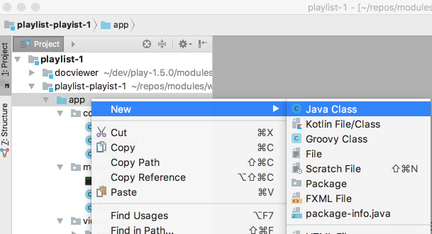
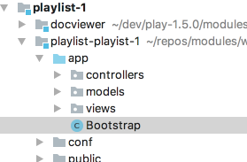
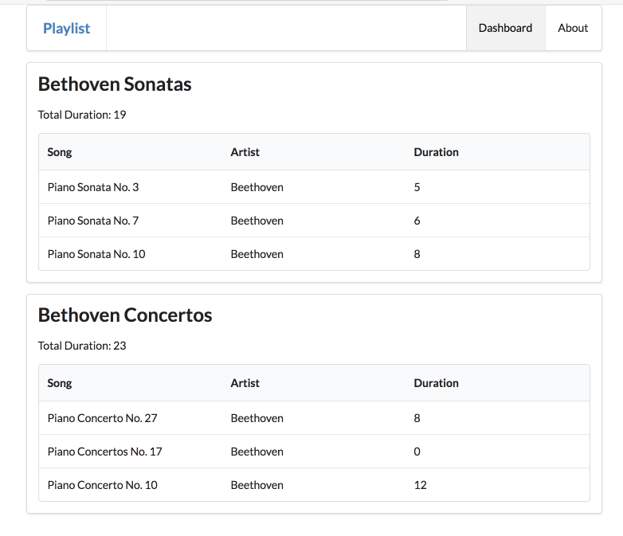

# Bootstrap

Create a new class in the `app` package:

~~~
import java.util.List;

import play.*;
import play.jobs.*;
import play.test.*;
 
import models.*;
 
@OnApplicationStart
public class Bootstrap extends Job 
{ 
  public void doJob()
  {
    Fixtures.loadModels("data.yml");
  }
}
~~~

Do this be selecting the `app` package, and then selecting `New->Java Class`

Creating the class:

The class should be in the `app` package:

Restart the project - and visit the Dashboard view. You should see the playlists in data.yml rendered to the view. 

Keep a close eye on the console as you do this - you should see something like this:

~~~
~        _            _
~  _ __ | | __ _ _  _| |
~ | '_ \| |/ _' | || |_|
~ |  __/|_|\____|\__ (_)
~ |_|            |__/
~
~ play! 1.5.0, https://www.playframework.com
~
~ Ctrl+C to stop
~
~ using java version "1.8.0_162"
Listening for transport dt_socket at address: 8000
17:53:49,806 INFO  ~ Starting /Users/edeleastar/dev/playlist-2
17:53:49,906 WARN  ~ You're running Play! in DEV mode
17:53:50,007 INFO  ~ Listening for HTTP on port 9000 (Waiting a first request to start) ...
~ Server is up and running
17:53:59,610 INFO  ~ HikariPool-1 - Starting...
17:53:59,648 INFO  ~ HikariPool-1 - Start completed.
17:53:59,662 INFO  ~ Connected to jdbc:h2:mem:play for default
17:54:00,703 INFO  ~ Application 'playlist-2' is now started !
17:54:01,593 INFO  ~ Rendering Start
~~~

The 'Rendering' messages are familiar - but we have some new messages relating to the database.

To display the playlist from the database - here is a revised version of the dashboard controller:

## app/controllers/Dashboard.java

~~~
package controllers;

import java.util.ArrayList;
import java.util.List;

import models.Playlist;
import models.Song;
import play.Logger;
import play.mvc.Controller;

public class Dashboard extends Controller
{
  public static void index() 
  {
    Logger.info("Rendering Admin");
    
    List<Playlist> playlists = Playlist.findAll();
    render ("dashboard.html", playlists);
  }
}
~~~