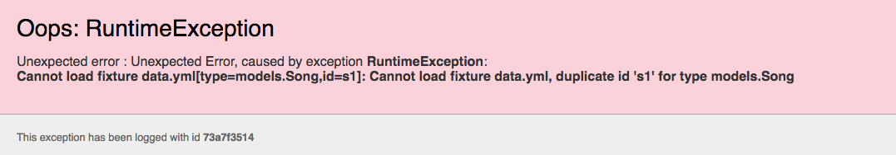

# Playlists

In order to display the correct playlist, we need to extract the id from the url and then fetch the playlist from the model. Modify the playlist controller as follows:

~~~js
...

public class PlaylistCtrl extends Controller
{
  public static void index(Long id)
  {
    Playlist playlist = Playlist.findById(id);
    Logger.info ("Playlist id = " + id);
    render("playlist.html", playlist);
  }
}
~~~

The `id` from the route is passed as a parameter to the method. We use this id to get the correct playlist object:

~~~
    Playlist playlist = Playlist.findById(id);
    Logger.info ("Playlist id = " + id);
~~~

Run the app and select each of the playlist links in turn. The logs will display each of the Ids in turn. A different id should be logged.

Check the database to verify that these IDs are correct:

- <http://localhost:9000/@db>

Occasionally, you may see an error like this:

When this occurs - restart the application (Ctrl-C and the `play run` again).

Here is a revised version of the Playlist view:

## app/views/playlist.html

~~~
#{extends 'main.html' /}
#{set title:'Playlist' /}

#{menu id:"dashboard"/}

<section class="ui segment">
  <h2 class="ui header">
    ${playlist.title}
  </h2>
  <table class="ui table">
    <thead>
      <tr>
        <th>Song</th>
        <th>Artist</th>
      </tr> 
    </thead>
    <tbody>
    #{list items:playlist.songs, as:'song'}
      <tr>
        <td>
          ${song.title}
        </td>
        <td>
          ${song.artist}
        </td>
      </tr>
    #{/list}
    </tbody>
  </table>
</section>
~~~

Rerun the app now and verify that you can view each playlist. Check the database to confirm the IDs match.

We alrady have a `listsongs.html` partial:

## app/views/tags/listsongs.html

~~~
<table class="ui fixed table">
  <thead>
    <tr>
      <th>Song</th>
      <th>Artist</th>
      <th>Duration</th>
    </tr>
  </thead>
  <tbody>
    #{list items:_playlist.songs, as:'song'}
      <tr>
        <td>
          ${song.title}
        </td>
        <td>
          ${song.artist}
        </td>
        <td>        
          ${song.duration}
        </td>        
      </tr>
    #{/list}
  </tbody>
</table>
~~~

We could change the Playlist controler to call this to do th work of building the song table:

## app/views/playlist.html

~~~
#{extends 'main.html' /}
#{set title:'Playlist' /}

#{menu id:"dashboard"/}

<section class="ui segment">
  <h2 class="ui header">
    ${playlist.title}
  </h2>
  #{listsongs playlist:playlist /}
</section>
~~~

Verify that all of this works as expected.

