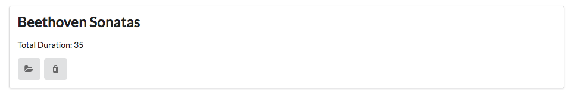

# Exercises

## Exercise 1: Download and Rename Sample Solution

A complete version of the app as it should be at the end of this lab:

- <https://github.com/edeleastar/playlist/releases/tag/playlist.3.end>

However, if you already have a project called 'playlist' in Idea, then it might be confusing So, first rename the project to `playlist-2` (covered in step 1 of lab07b), and then run this command:

~~~
play idealize
~~~

... and then open with Idea.

## Exercise 2: UX Enhancements

Introduce a 'Delete Playlist' button for each playlist, represented by a `trash` icon. E.g:

In addition, the `view` link is replace by a `folder open` icon.

Bind the `delete playlist` button to a new function to be implemented in the Dashboard controller, which should log the id of the playlist to be deleted.

## Exercise 3: Delete Playlist Functionality

Make the button actually delete the denoted playlist.

