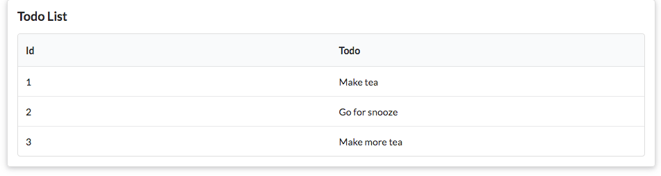

# Exercise 5: Admin Feature

Introduce a new route into the app:

- <http://localhost:9000/admin>

Which should display:

This will involve:

- a new route
- a new controller called Admin
- a method in that controller that fetches all todos and sends them to a new view
- call this new view `admin.html`

## Hint

Exercise 2 Solution in Lab08b implemented something similar:

- [Admin Exercise Solution from Lab08b](../../topic08/book-b-playlist-3/index.html)