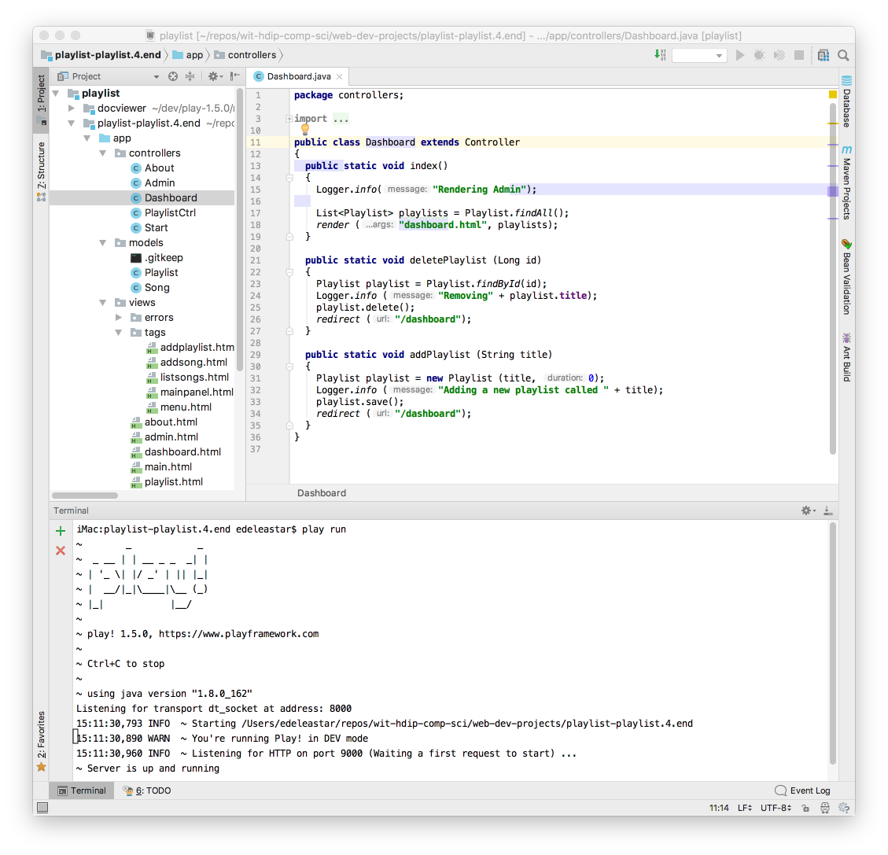
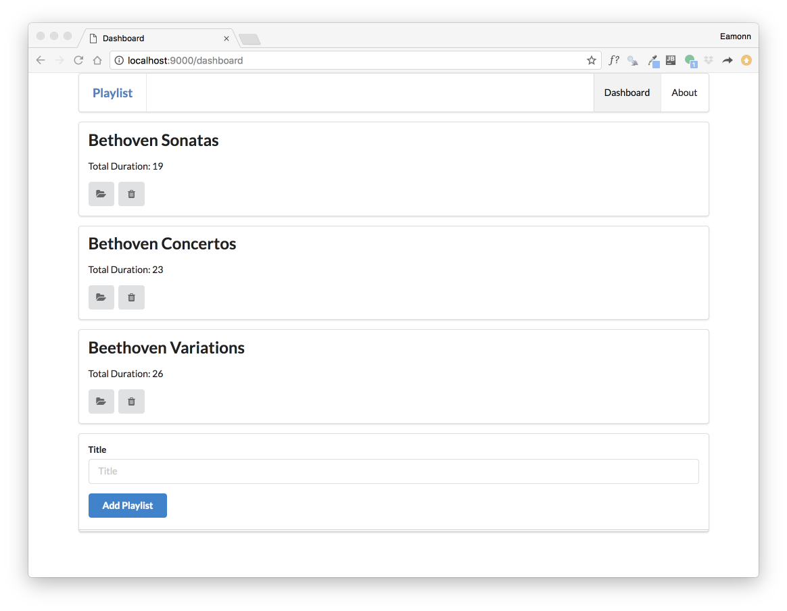

# Setup

In Lab 09b, we extended the original playlist application to support the creation and deletion of playlists + songs.

This is the version as we left it:

 - <https://github.com/edeleastar/playlist/releases/tag/playlist.4.end>

Download this archive - unzip it, and make it available for Idea by entering:

~~~
play idealize
~~~

Inside the download folder. Open the project in Idea:

You can run the application from inside IDE via the terminal (as shown above).

Verify the basic operation of the app:

All the buttons should work

