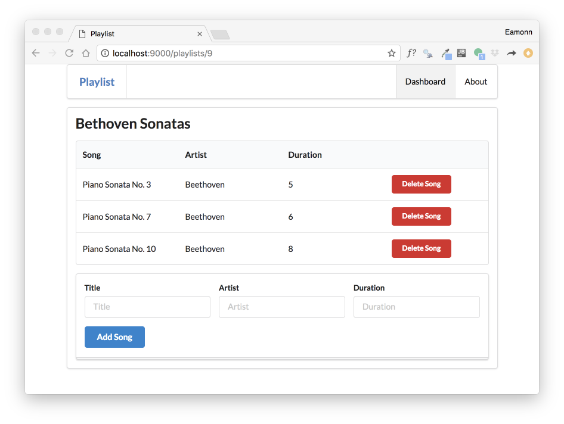

# Review the Dynamic Routes + Controllers

These routes here are a little different, in that they each contain at least one item in braces:

~~~
GET     /playlists/{id}                         PlaylistCtrl.index
GET     /dashboard/deleteplaylist/{id}          Dashboard.deletePlaylist
GET     /playlists/{id}/deletesong/{songid}     PlaylistCtrl.deleteSong
~~~

Take this one for instance:

~~~
GET     /playlists/{id}                         PlaylistCtrl.index
~~~

This is the matching controller method:

~~~
  public static void index(Long id)
  {
    Playlist playlist = Playlist.findById(id);
    Logger.info ("Playlist id = " + id);
    render("playlist.html", playlist);
  }
~~~

and this is the view:

~~~html
#{extends 'main.html' /}
#{set title:'Playlist' /}

#{menu id:"dashboard"/}

<section class="ui segment">
  <h2 class="ui header">
    ${playlist.title}
  </h2>
  #{listsongs playlist:playlist /}
  #{addsong playlist:playlist /}
</section>
~~~

This renders as:

The key aspect to note here is the `{id}` is replaced by an actual number (9 in the example). And this number is passed to index as `id`:

~~~
  public static void index(Long id)
~~~

.. and then used to locate the specific playlist in the model:

~~~
    Playlist playlist = Playlist.findById(id);
~~~ 

This fetched playlist is then passed to the view:

~~~
    render("playlist.html", playlist);
~~~

.. and is in turn passed by the view to the `listsongs` partial:

~~~
  #{listsongs playlist:playlist /}
~~~

Listsongs then iterates through the array, displaying each song in turn:

~~~
<table class="ui fixed table">
  ...  
    #{list items:_playlist.songs, as:'song'}
      <tr>
        <td>
          ${song.title}
        </td>
        <td>
          ${song.artist}
        </td>
        <td>        
          ${song.duration}
        </td>      
         <td>
            <a href="/playlists/${_playlist.id}/deletesong/${song.id}" class="ui tiny red button">Delete Song</a>
          </td>         
      </tr>
    #{/list}
  ...
</table>
~~~

Sounds complicated! - However this is typical of the lifecycle of requests/response in web applications.

## Exercise 

Try the above exercise - inspecting the lifecycle of these routes:

~~~
GET     /dashboard/deleteplaylist/{id}          Dashboard.deletePlaylist
GET     /playlists/{id}/deletesong/{songid}     PlaylistCtrl.deleteSong
~~~

The last one is particularly interesting - notice there are 2 variables in braces: `{id}` and `{songid}`. Why are both needed?

