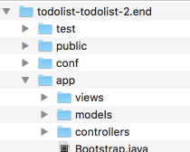

# Preparing the Play Application for Deployment

You may have your own version of the Todolist 2 application - which you can use for the rest of this lab. Alternatively, you can download the the version we left at the end of lab 10:

- <https://github.com/edeleastar/todolist/releases/tag/todolist-2.end>

If you download the zip above, and expand - you will have a complete Play application like this:

We need to make the set the following parameters to prepare it for deployment:

- JDK Version
- Play Version
- Database Settings

You may want to import the project into Idea to make the changes below.

## (1)JDK Version

Create a new file in the project root:

### system.properties

~~~
java.runtime.version=8
~~~

This sets the JDK version our app will need when deployed.

## (2) Play Version

Locate this file:

## conf/dependencies.yml

~~~
# Application dependencies

require:
    - play
~~~

Change it to the following:

~~~
# Application dependencies

require:
    - play 1.5.0
    - org.postgresql -> postgresql 42.2.2:
       force: true
~~~

This determines the precise version of Play + the database drivers it should use.

## (3) Database Settings

We also need to set the database connection configuration to use when deployed. Open `application.conf` and locate the following line:

## conf/application.conf

~~~
db.default=mem
~~~

Comment out this line by placing a `#` in the first line:

~~~
# db.default=mem
~~~

Insert the following directly below:

~~~
db=${DATABASE_URL}
jpa.dialect=org.hibernate.dialect.PostgreSQLDialect
jpa.ddl=update
~~~

NB: This very last change will mean that YOUR APP WILL NO LONGER RUN LOCALLY! (apologies for the caps). So you will need to reverse the very last change if you want to run locally again.
