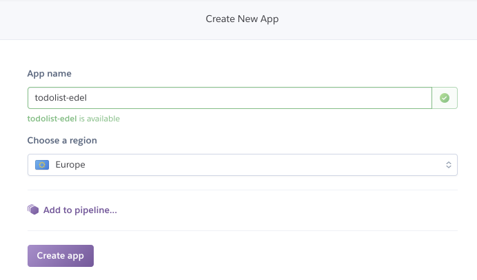
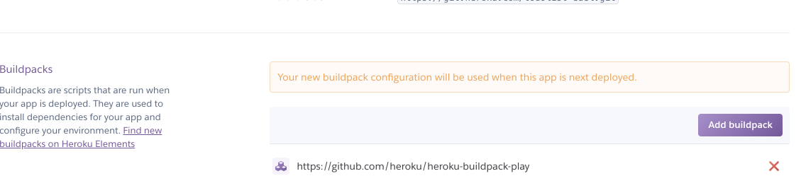

# Creating & Configure the Application on Heroku

Now we need to create and configure the application on Heroku:

- Create App
- Link to Dropbox
- Configure Buildpack

## (1) Create Application

Back in the Heroku 

- <https://www.heroku.com>

Log in and you should see the main Dashboard:

Select 'New` and create a new application.

Give the app a name - this will have to be unique, so perhaps consider using your initials or name in the application name:

You might also locate the app in Europe. Press `Create App` and an application console will be displayed:

## (2) Link to Dropbox

One of the options is `Dropbox` ... press it and you will be asked to authorise against your Dropbox credentials.

The Control panel will now have these additional options.

Also, check your Dropbox folder on your workstation. It should have a new folder - the same name as the application you created - inside an `Dropbox/Apps/Heroku` folder

When we are ready to deploy our application we place a copy in here. Do this now, copy the contents of the todolist folder into the newly created folder:

It might look like this:

We now have 2 versions of our app - then one we are working on, perhaps in IDEA - and another version we have copied out to a dropbox folder.

If you are using one of your own projects, be sure to exclude a `.git` subdirectory (if there is one) from the copy on dropbox.

## (3) Configure Buildpack

We are now almost ready to deploy. We need to do one more step. Back in Heroku, switch to the `Settings` panel:

Press the `Add Buildpack`:

In the above, we have added this url:

~~~text
https://github.com/heroku/heroku-buildpack-play
~~~

Save changes and the buildpack should be installed:

The build pack is needed to inform Heroku how a play app is configured and managed.

