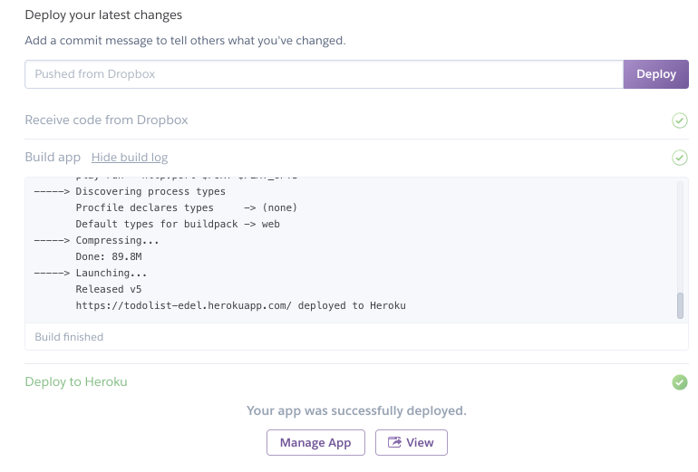

# Deploy the Application

Back in the `Deploy` panel - we can now press the `Deploy` button.

This will take a minute or so - and will log its progress...

If all goes well -- it should look like this:

This could take a minute or two...

Note the green tick indicating it is deployed. Press `View` and the app should be available:

Log in as `homer@simpson.com`, `secret`

You should be able to ad and remove todos. Log out, sign up a new user etc...

