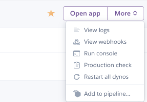
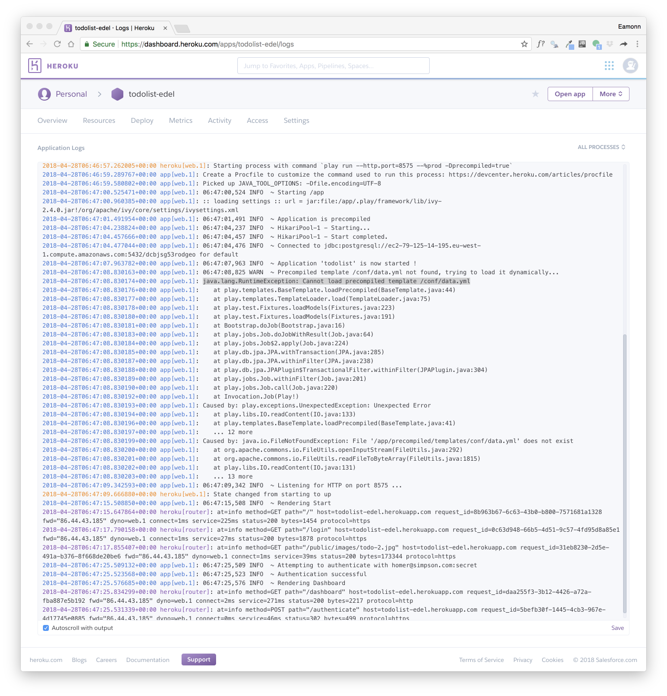
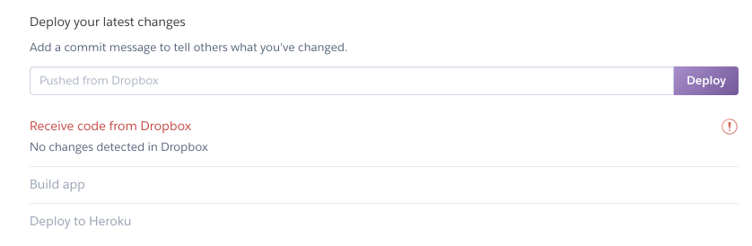

## Logs

Back in the Heroku Console - select `more` on the top right:

Select `View logs`. 

This is the equivalent of the console when you were running the app locally on your workstation. When testing the deployed application it is useful to always keep this view open. It enables you to monitor the application, identify potential errors and generally keep an eye on its operation.

You now have 2 versions of the source of your application

- The version you are developing using IDEA
- A copy of the application on a dropbox folder, shared with Heroku.

It is a good idea to keep these separate - and when you update the application you copy the source over to the dropbox version.

## Running Locally

Please note: This change you made to `conf/application.conf`:

## conf/application.conf

~~~
# db.default=mem

db=${DATABASE_URL}
jpa.dialect=org.hibernate.dialect.PostgreSQLDialect
jpa.ddl=update
~~~

Will prevent you from running the application locally. i.e. it will fail to launch when running via the `play run` command. Therefore, for the version of the application you are editing via IDEA, make suer to reverse the changes if you wish to run locally:

~~~
db.default=mem

# db=${DATABASE_URL}
# jpa.dialect=org.hibernate.dialect.PostgreSQLDialect
# jpa.ddl=update
~~~

Perhaps best to keep this file NOT in sync with the version on dropbox

## Deploying Again

The procedure for updating the running app is to

- Copy the relevant source into the dropbox version
- Press the `Deploy` button again:

In the above example - it has not detected any changes, so will not deploy.

When deploying, the Build Logs become visible:

These logs are separate from the run time logs described above. You will need to monitor these logs occasionally in case any errors arise.