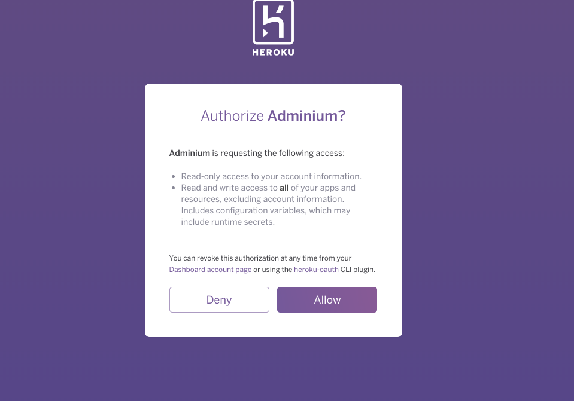
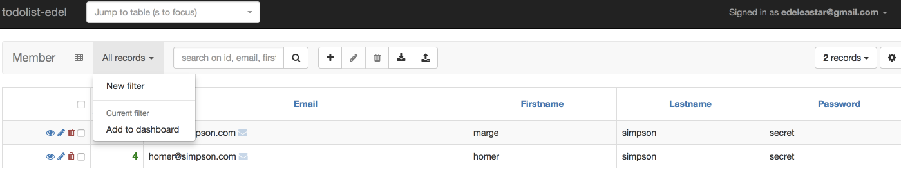

# Database Dashboard

If you have been relying on this link:

- <http://locathost9000/@db> 

...to view the browser when running locally - this will NOT work for the deployed version. 

However, Heroku supports a free add-on which fulfils a similiar role:

- <https://www.adminium.io/dashboard>

Associating this service with your app is reasonably straightforward, and is all carried via the web interface.

It will involve installing the Addon:

This will ask for authorisation:

You will then be asked to enable it for your application - and you will eventually be able to browse its models like this:

You will even be able to edit the contents.

You will also be able to add tables to a `Dashboard` :

The dashboard is available at this url:

- <https://www.adminium.io/dashboard>

There are additional Widgets you can experiment with here to monitor database activity over time.
