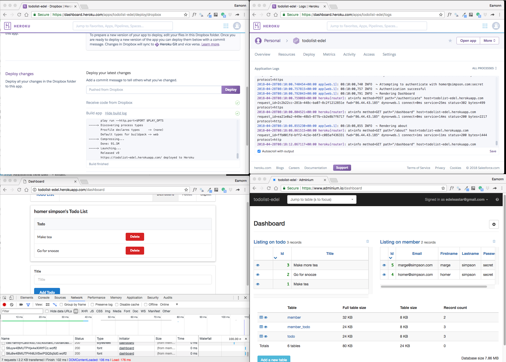

# Exercises

## Exercise 1: Deploy Playlist 5

Deploy the latest playlist application:

- <https://github.com/edeleastar/playlist/releases/tag/playlist.5.end>

You will need to follow precisely steps 02, 03 and 04 from this lab.

## Exercise 2: Workspace

See if you can arrange your workspace like this:

Here we are monitoring the deploy logs, the main application logs, the database console and the application itself (including the browser tools).

Try some variation of this now and get familiar with the nature of the information in each of the windows. Proceed through a deploy cycle while doing this (make a cosmetic change to the app in dropbox to allow a deploy to be triggered)

