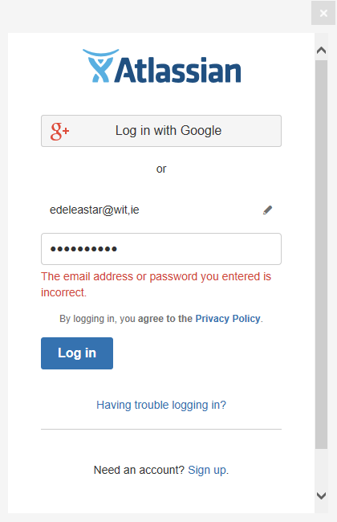

# Install Sourcetree

Visit:

- <https://www.sourcetreeapp.com/>

And download and install the application for your platform.

On the very first screen - you will be asked to log in to `Atlassian`. Your bitbucket credentials should work here...

During installation you will be asked to link your sourcetree installation to github and to bitbucket

This are the first install screen you will see:

Here you will be asked to log in to an `Atlassian` account:

The credentials here should be the same as your bitbucket account details from the last step.

We would like to link our Sourcetree installation to both Bitbucket & Github:

Selecting each of the above will take you through an authorisation sequence with both services.

If all goes well, the Sourcetree home screen will launch:

To see if the both the bitbucket a github accounts are properly linked, select `Tools->Options->Authentication` :

This should show the both accounts linked as above. If not, you can press `add` and link them now (no need to reinstall).