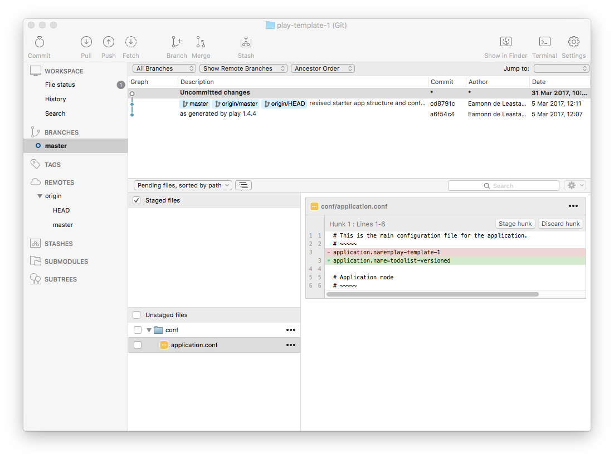
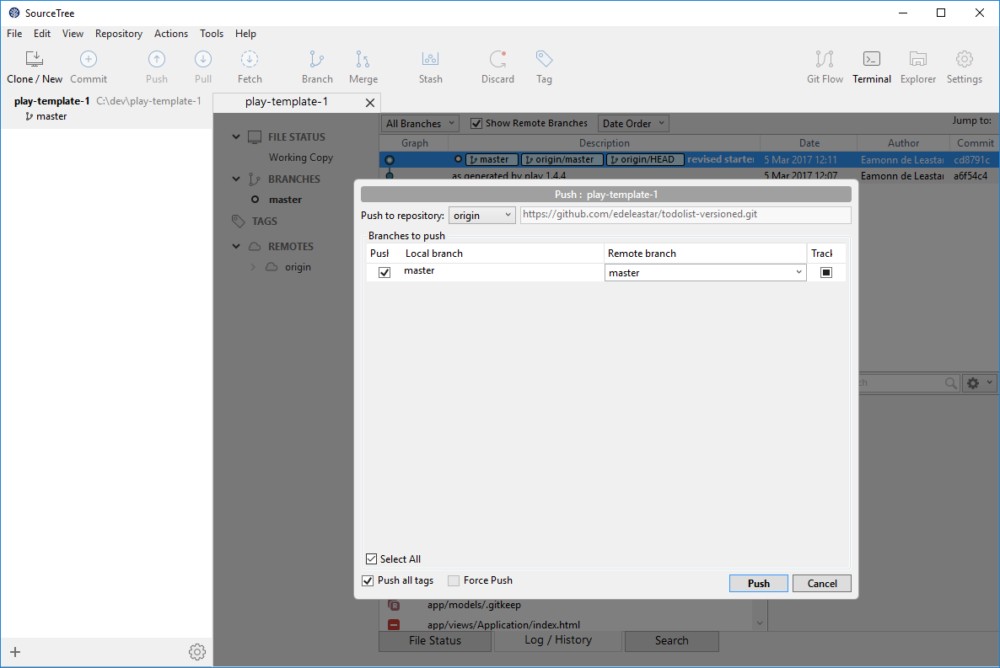

# Set Remote Repo

Your Sourcetree app currently looks like this:

Locate the `todolist-versioned` folder we just created, and drag and drop it onto SourceTree:

Select it in the navigation panel, and we have a more detailed view:

Select `Repository->Settings` - and you will get details of the current `remote` repo this repository is connected to:

Select `Edit` - and change URL / Path to the url you should have in the clipboard from step 3:

