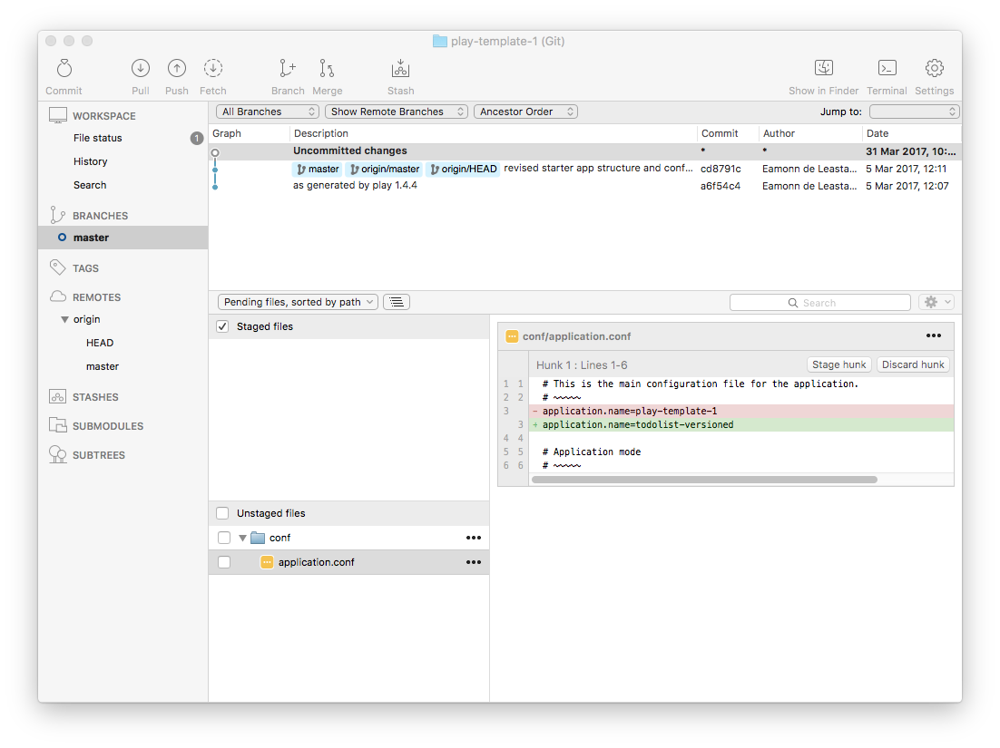
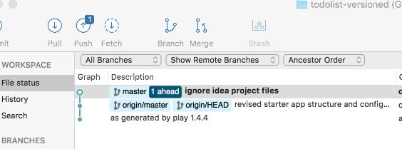
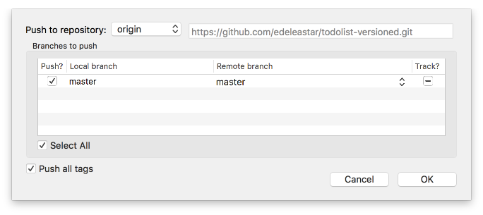
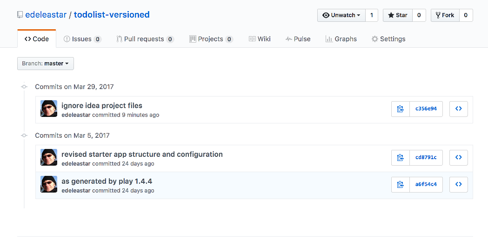

# todolist-versioned Project

We should have our project in Sourcetree from the last lab:

Notice we have 'uncommitted changes' in the above - this is the modification we made to application.conf to rename the project. We will return to this in a moment.

First, if we would like to use Intellj Idea - we can 'idealize' then app:

~~~
play idealize
~~~

... and then import into Idea.

For this lab, keep both Idea & Sourcetree open at the same time.

The first thing to notice is the Sourcetree view will have changed slightly: 

This is because the idealize command as generated some new files in our project:

- play-template-1.iml
- play-template-1.ipr
- play-template-1.iws

These are configuration file for Idea. We dont need to be concerned with them, and we dont want them committed to our repository as they are not code really. We need to tell git to ignore them.

The built in mechanism for ignoring files in git is to plate the file names, or patterns, in a file called `.gitignore`. We already have one:

## .gitgnore

~~~
.settings
eclipse
documentation
tmp
.classpath
.project
~~~

Edit it now in Idea - and append paths to ignore the Idea files:

~~~
...
*.iml
*.ipr
*.iws
~~~

Save this file - and review the Sourcetree view again:

The change is subtle - git is no longer 'tracking' the idea files, but notice that it reporting the one of the files we are tracking - .gitignore - is showing up as having a change, and we still have the change to application.conf (the rename).

This change is noted, but not 'staged' or 'committed' yet. We will do both now

## Staging

To stage the changes, we just select all the 'Unstaged files' check box - which reconfigures the view like this:

## Commit

To commit, press the `Cmomit button`:

We are now invited to enter a message describing the change. Enter this message:

~~~
rename project + ignore idea files
~~~

and then press the blue Commit button on the bottom right. The Sourcetree will layout like this now:

Our change has been committed - and there are no outstanding changes. Notice, however, that the `Push` button is slightly changed:

The superscript '1' indicates that the local repo (the one on your workstation) is 1 ahead (in terms of changes) of the remote repo (the one you created on github.com).

If we press the push button - this dialog appears:

Pressing 'OK' here will push the channges, such that the local and remote repositories are in sync.

Check the repo on github.com to make sure is has the latest version:

For each step in this lab we will be proceeding through this workflow:

- Make some changes to the project
- Stage the changes
- Commit the changes
- Push them to the remote repository
- Check to see if they have arrived (sometimes).

