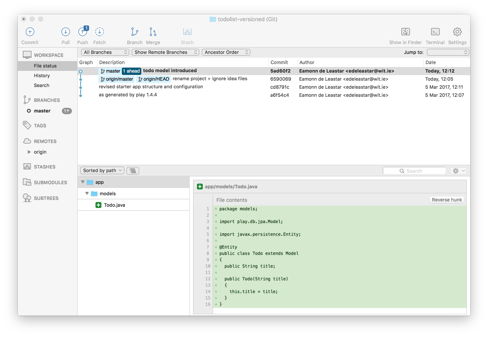

# Model

We can bring in a Todo model now:

## app/models/Todo.java

~~~
package models;

import play.db.jpa.Model;

import javax.persistence.Entity;

@Entity
public class Todo extends Model
{
  public String title;

  public Todo(String title)
  {
    this.title = title;
  }
}
~~~

As soon as we save the file, notice the changes have been detected in Sourcetree:

We can stage, commit and push whenever we like - usually we stage and commit when we have introduced a significant change. We would only push occasionally.

Lets stage and commit now.

## Stage:

## Commit:

Note the message we entered on the commit - a short description of the change.

