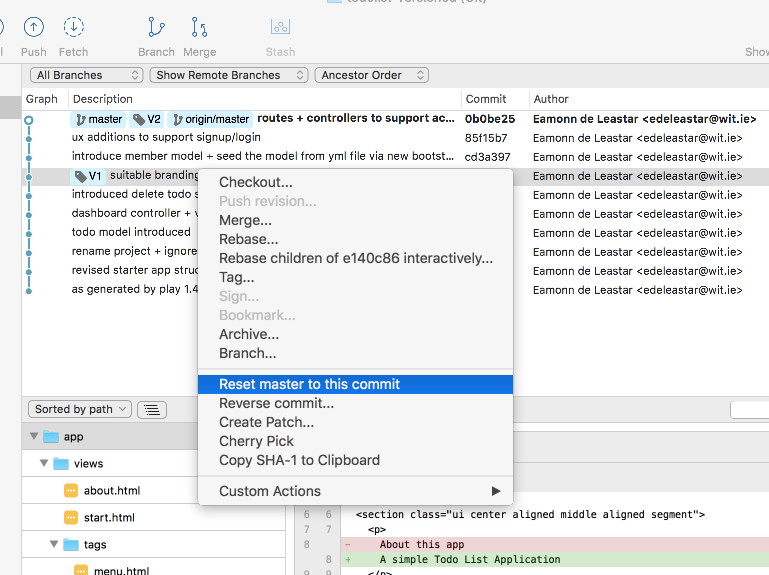

# Exercises

Your repo should be structured something like this one now:

- <https://github.com/edeleastar/todolist-versioned>

## Exercise 1: Running an Earlier Version

In Sourcetree, select the `V1` tagged commit, right click and select `Reset master to this commit` as shown here:

In the subsequent dialog, select 'Hard - diacard all working copy changes'

You will get a warning - which you can accept:

The project folder will now contain the V1 project. 

You can run this version now - and make sure it is that version (no member support)

## Exercise 2: Get back to the latest version

See if you can get back to V2 - it is more or less the same procedure as getting to V1, but in reverse.

## Exercise 3: Clone the repo

Figure out how to clone the repo into another folder on your workstation. Once cloned, you can drag/drop the new copy int Sourtree alongside the original.

Idealize the new copy and import into Idea, and run it. (Continue to use eclipse if you like).

Make some changes in the new copy - for instance the signup and login files have links to images which do not exist. Find suitable images - and put them into `/public/images`. Make sure the names match what the forms expect.

Stage, commit and push these changes from the new copy.

Back in the original, pull the changes into this version. Make sure the changes have come over.
